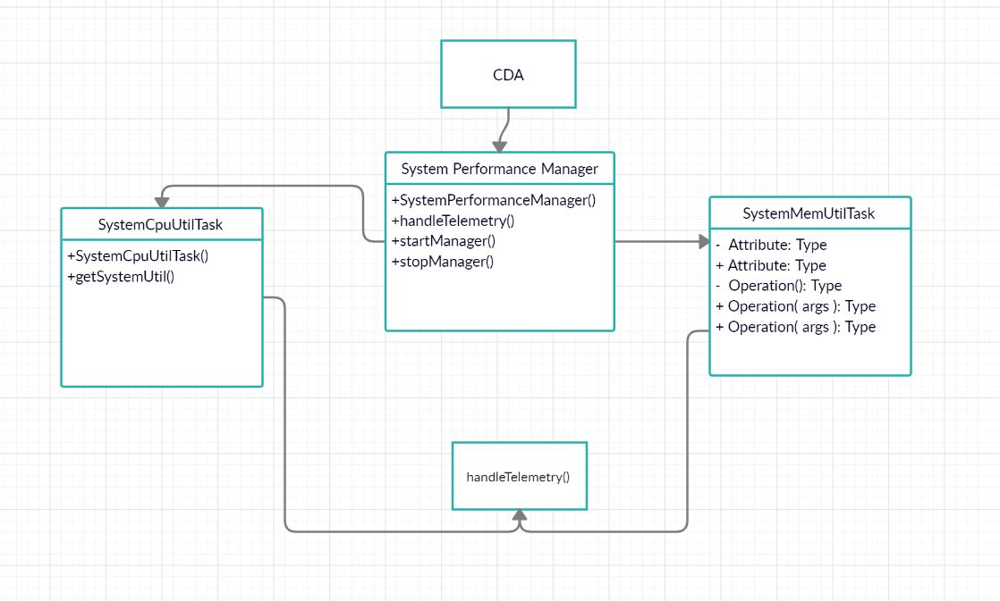

# Constrained Device Application (Connected Devices)

## Lab Module 02

Be sure to implement all the PIOT-CDA-* issues (requirements) listed at [PIOT-INF-02-001 - Chapter 02](https://github.com/orgs/programming-the-iot/projects/1#column-9974938).

### Description

NOTE: Include two full paragraphs describing your implementation approach by answering the questions listed below.

What does your implementation do? 
-Constrained Device App (CDA) that will run on  “constrained device” will collect some basic telemetry.This exercise is certainly to obtain the CPU utilization, but also to establish a pattern of separation of control, or separation of key functions so they can be managed and updated separately from the rest of the application’s logic.

How does your implementation work?

-ConstrainedDeviceApp is the entry point for the application and creates the instance of, and manages, SystemPerformanceManager. There are also two other components - SystemCpuUtilTask and SystemMemUtilTask. As their names imply, these are components that will collect system CPU utilization and system memory utilization. These components will be managed by SystemPerformanceManager and run as asynchronous threads that update a method you’ll define within SystemPerformanceManager

### Code Repository and Branch

NOTE: Be sure to include the branch (e.g. https://github.com/programming-the-iot/python-components/tree/alpha001).

URL:https://github.com/NU-CSYE6530-Fall2020/constrained-device-app-Nitinsd96/tree/chapter02

### UML Design Diagram(s)

NOTE: Include one or more UML designs representing your solution. It's expected each
diagram you provide will look similar to, but not the same as, its counterpart in the
book [Programming the IoT](https://learning.oreilly.com/library/view/programming-the-internet/9781492081401/).

### Unit Tests Executed

NOTE: TA's will execute your unit tests. You only need to list each test case below
(e.g. ConfigUtilTest, DataUtilTest, etc). Be sure to include all previous tests, too,
since you need to ensure you haven't introduced regressions.

- ConfigUtilTest
- SystemMemUtilTaskTest
- SystemCpuUtilTaskTest

### Integration Tests Executed

NOTE: TA's will execute most of your integration tests using their own environment, with
some exceptions (such as your cloud connectivity tests). In such cases, they'll review
your code to ensure it's correct. As for the tests you execute, you only need to list each
test case below (e.g. SensorSimAdapterManagerTest, DeviceDataManagerTest, etc.)

- SystemPerformanceManagerTest
- ConstrainedDeviceAppTest
- 

EOF.
