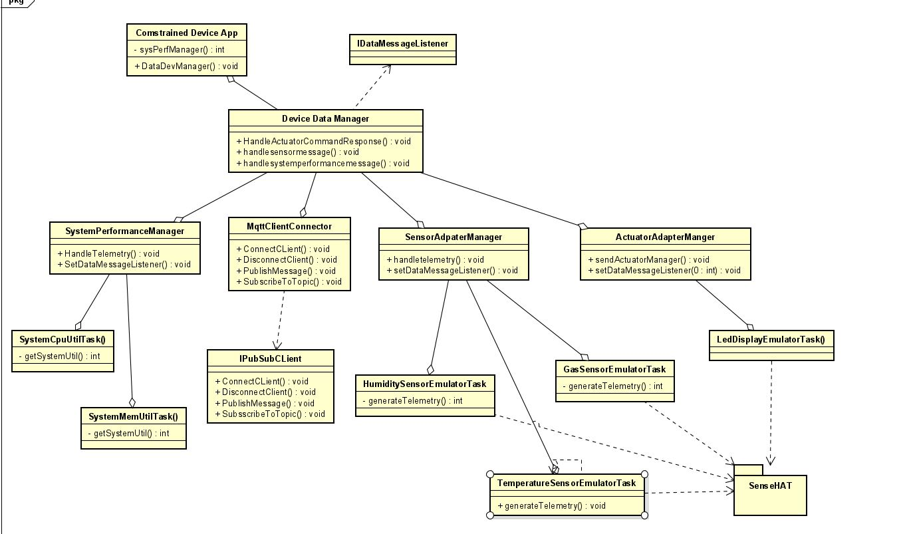

# Constrained Device Application (Connected Devices)

## Lab Module 12 - Semester Project - CDA Components

Be sure to implement all the PIOT-CDA-* issues (requirements) listed at [PIOT-INF-10-001 - Chapter 10](https://github.com/orgs/programming-the-iot/projects/1#column-10488510).

### Description

NOTE: Include two full paragraphs describing your implementation approach by answering the questions listed below.

What does your implementation do? 
-
I am trying to monitor Air pollution levels through this system. This system can help the users to stay updated with air levels of their surroundings. Moreover, they will get to know when the air is polluted or gas is leaked. This system can help them by giving heads up prior to such situation.

How does your implementation work?
- Using gas sensors to predict air levels
- Using CDA to store and send data to GDA
- Communication using MQTT between CDA and GDA
- Using ubidots to store and analyse data to predict whether the levels are good/bad
- sending notification to phone in case of emergency

### Code Repository and Branch

NOTE: Be sure to include the branch (e.g. https://github.com/programming-the-iot/python-components/tree/alpha001).

URL: https://github.com/NU-CSYE6530-Fall2020/constrained-device-app-Nitinsd96/tree/chapter12

### UML Design Diagram(s)

NOTE: Include one or more UML designs representing your solution. It's expected each
diagram you provide will look similar to, but not the same as, its counterpart in the
book [Programming the IoT](https://learning.oreilly.com/library/view/programming-the-internet/9781492081401/).

### Unit Tests Executed

NOTE: TA's will execute your unit tests. You only need to list each test case below
(e.g. ConfigUtilTest, DataUtilTest, etc). Be sure to include all previous tests, too,
since you need to ensure you haven't introduced regressions.

- 
- 
- 

### Integration Tests Executed

NOTE: TA's will execute most of your integration tests using their own environment, with
some exceptions (such as your cloud connectivity tests). In such cases, they'll review
your code to ensure it's correct. As for the tests you execute, you only need to list each
test case below (e.g. SensorSimAdapterManagerTest, DeviceDataManagerTest, etc.)

- ConstrainedDeviceApp
- 
- 

EOF.
